# 外部IPアドレスを持たないVMインスタンスからCloudNAT経由でインターネットへアクセスする

## これは何？
- 外部IPアドレスを持たないVMインスタンスからCloudNAT経由でインターネットへアクセスするサンプルです
- Terraformによって必要なリソースを作成することができます

## なんのリソースが作成されるの？
- GCPでVPCネットワークとサブネットワークを作成し、VMインスタンスを2つ起動します
- 1つのVMインスタンスは踏み台として、外部IPアドレスを付与します
- もう１つのVMインスタンスは外部IPアドレスを付与しません
- CloudNAT、CloudRouter、Firewallルールを設定します

## 完成イメージ図

1. 外部IPアドレスを持つインスタンス `bastion` にSSH接続します
2. `basion` から `my-instance` にSSH接続します
3. `my-instance` から `Cloud NAT` 経由でインターネットに接続します

## セットアップ
- `Terraform v0.14.5`のインストール
  - https://releases.hashicorp.com/terraform/
- Google Cloud Platformのprojectを作成する
  - https://cloud.google.com/resource-manager/docs/creating-managing-projects
- GCP StorageのBucketを作成する
  - https://cloud.google.com/storage/docs/creating-buckets
- `gcloud CLI`のインストール（VMインスタンスにSSH接続したい場合）
  - https://cloud.google.com/sdk/gcloud

## リソースの作成
```
$ export GCP_PROJECT_ID="your-gcp-project-id"
$ export GCS_BUCKET_NAME="your-gcs-bucket-name"
$ export USER_MAIL="your-google-user-mail-to-allow-ssh-acccess@gmail.com"

$ bin/apply $GCP_PROJECT_ID $GCS_BUCKET_NAME $USER_MAIL
```

## リソースの削除
```
$ export GCP_PROJECT_ID="your-gcp-project-id"
$ export GCS_BUCKET_NAME="your-gcs-bucket-name"
$ export USER_MAIL="your-google-user-mail-to-allow-ssh-acccess@gmail.com"

$ bin/destroy $GCP_PROJECT_ID $GCS_BUCKET_NAME $USER_MAIL
```

## VMインスタンスへのSSH接続してネットワークが繋がるか確認する
```
$ export GCP_PROJECT_ID="your-gcp-project-id"

# GCPのprojectを作成したgoogleアカウントでログインする（すでにログインしてる場合は不要）
$ gcloud auth login

# 踏み台サーバーにSSH接続する
$ gcloud beta compute ssh --zone asia-northeast1-a bastion --project $GCP_PROJECT_ID
# 踏み台サーバーから外部IPを持たないVMインスタンスにSSH接続する
$ gcloud compute ssh --zone asia-northeast1-a my-instance --internal-ip
# グローバルIPアドレスを取得できるか確認する
$ curl httpbin.org/ip
```
